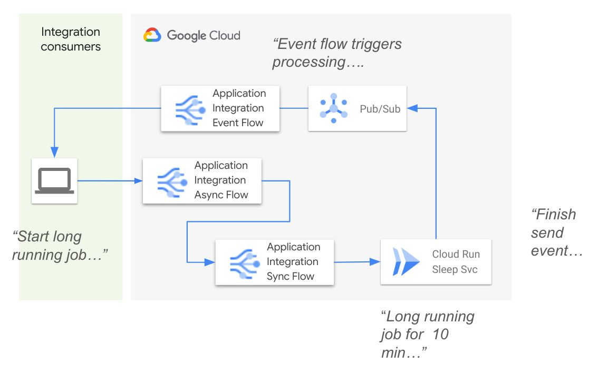

# Application Integration Long Processing Sample
This project shows a sample to handle long running HTTP calls in Application Integration. The timeout for the `Call REST Endpoint` task is currently around 170s. If you have HTTP calls that take longer than 2-3 minutes, then this sample can show how to process the results without waiting or having timeouts using a Pub/Sub message as trigger to continue processing.



This uses a really useful feature in Application Integration that allows for multiple triggers in the same canvas, making it easy to resume processing depending on new events, such as from Pub/Sub here.

## Deploy
To deploy this solution, simply clone this repository and run these commands.
```sh
# first copy and change the env variables
cp 1.env.sh 1.env.local.sh
nano 1.env.local.sh
# source variables
source 1.env.local.sh

# deploy assets into a Google Cloud project
./2.create.resources.sh

# test calling the flow synchroniously
./3.test.flow.sync.sh

# test calling the flow asynchronously
./3.test.flow.async.sh

# check in the logs how the Pub/Sub event triggers further processing after 5 minutes
```
